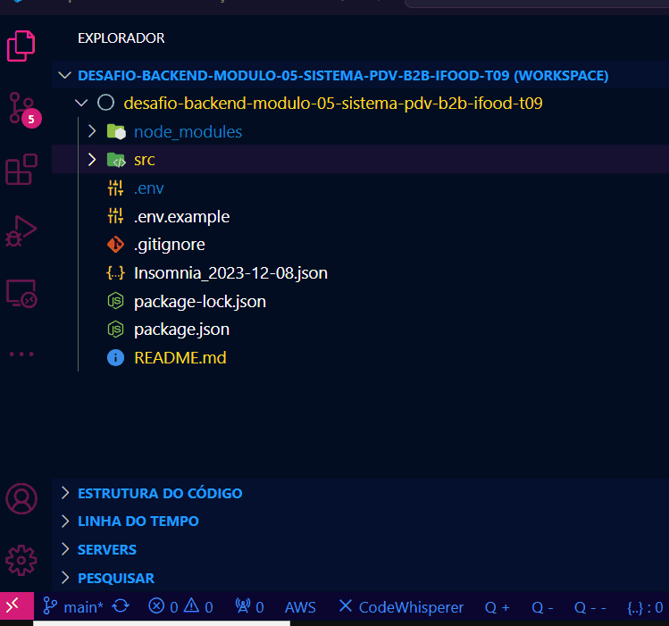
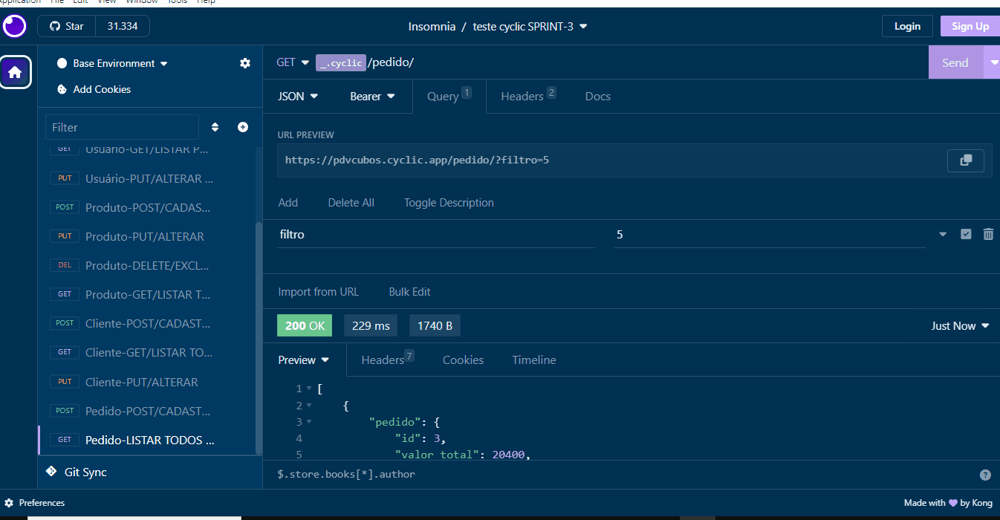

# Cubos Academy - Desafio Final - API para PDV


## Grupo 5 - DEPLOYráveis - Módulo 5 - Curso Backend
### T09 - Ifood - Alunas:

- <a href="https://www.linkedin.com/in/ingrid-rocha-91b846121/" target="_blank"></a>   [Ingrid Rocha](https://github.com/ingridrochadev)
- <a href="https://www.linkedin.com/in/patriciaffraga" target="_blank"></a>   [Patrícia F Fraga](https://github.com/patriciafraga)
- <a href="https://www.linkedin.com/in/pauladeandradesantos" target="_blank"></a>   [Paula A Santos](https://github.com/pauladeandradesantos) 
- <a href="https://www.linkedin.com/in/vanessa-schumacker-800318275/" target="_blank"></a>   [Vanessa Schumacker](https://github.com/VanessaSchumacker) 

## Descrição
Este projeto fornece uma API para integração com sistemas de Ponto de Venda (PDV). O Sistema de Frente de Caixa oferece recursos essenciais para gerenciar transações, cadastrar produtos, pedidos e clientes.
Trata-se de um projeto piloto, que faz parte do Desafio Final do curso de Backend da Cubos Academy.


## Início:
1. Fork e clonagem do repositório - Cubos Academy:
   git clone https://github.com/patriciafraga/desafio-backend-modulo-05-sistema-pdv-b2b-ifood-t09   

### **Dependências**
2. Instalar dependências de produção:

Para rodar as api foram instalados os pacotes: express bcrypt cors dotenv jsonwebtoken knex pg aws-sdk handlebars joi nodemailer multer. 
O nodemon foi instalado apenas como dependência de desenvolvimento.

### **Conexão PostgreSQL/Knex**
3. Configurar as variáveis de ambiente:

Para gerenciar e agregar segurança às conexões com banco de dados, envio de emails, upload de arquivos e deploy da API  foram utilizadas variáveis de ambiente por meio do dotenv, evitando a exposição de informações privadas, como no exemplo:

```javascript
require("dotenv").config();

const knex = require("knex")({
  client: "pg",
  connection: {
    host: process.env.DB_HOST,
    port: process.env.DB_PORT,
    user: process.env.DB_USER,
    password: process.env.DB_PASS,
    database: process.env.DB_NAME,
  
  },
});

module.exports = knex;

```

### **Inicializando o servidor**
```
npm run dev
npm run start

```

### **Validações**

As validações mais frequentes e relevantes foram alocadas em middlewares, na maior parte das vezes utilizando esquemas da biblioteca "Joi", como segue:

```javascript
const validarReqBody = (joiSchema) => async (req, res, next) => {
  try {
    await joiSchema.validateAsync(req.body, { messages: {} });
    next();
  } catch (error) {
    console.log(error.message);
    return res.status(400).json({ mensagem: error.message });
  }
};

const validarReqParams = (joiSchema) => async (req, res, next) => {
  try {
    await joiSchema.validateAsync(req.params, { messages: {} });
    
    next();
  } catch (error) {
    console.log(error.message);
    return res.status(400).json({ mensagem: error.message });
  }
};

module.exports = {
  validarReqBody,
  validarReqParams
};

```

### **Arquitetura em camadas**

De modo a especificar cada responsabilidade dentro da API, o código foi estruturado em camadas bem definidas, como segue:



### **Requisitos obrigatórios**

Foram cumpridos todos os requisitos obrigatórios:

- Responsabilidades de cada arquivo distribuídas adequadamente. 
- API acessando o banco de dados `pdv` para persistir e manipular os dados de categorias, clientes, pedidos, produtos e usuários utilizados pela aplicação. 
- Campos de id das tabelas no banco de dados com auto incremento, chave primária e não permitindo edição após criados.
- Valores monetários representados em centavos (Ex.: R$ 10,00 reais = 1000)

### **Endpoints / rotas**

Em razão da extensão dos endpoints, eles foram divididos por entidade dentro do diretório de rotas, como no exemplo abaixo:

```javascript
const express = require("express");
const rotas = express();
rotas.use(express.json());

const controladorCadastrarUsuario = require("../controladores/usuarios/controladorCadastrarUsuario");
const login = require("../controladores/usuarios/login");
const controladorAtualizarUsuario = require("../controladores/usuarios/controladorAtualizarUsuario");
const { obterPerfil, autenticacao } = require("../intermediarios/autenticacao");
const { validarReqBody } = require("../intermediarios/validarRequisicao");

const schemaUsuario = require("../validacoes/schemaUsuario");
const schemaLogin = require("../validacoes/schemaLogin");

rotas.post(
  "/usuario",
  validarReqBody(schemaUsuario),
  controladorCadastrarUsuario
);
rotas.post("/login", validarReqBody(schemaLogin), login);

rotas.use(autenticacao);

rotas.get("/usuario", obterPerfil);
rotas.put(
  "/usuario",
  validarReqBody(schemaUsuario),
  controladorAtualizarUsuario
);

module.exports = rotas;
```

```javascript
const express = require("express");
const rotas = express();
rotas.use(express.json());
const controladorListarCategorias = require("../controladores/categorias/controladorListarCategorias");

rotas.get("/categoria", controladorListarCategorias);

module.exports = rotas;
```
### Endpoints cadastrados:

POST/usuario: Cadastrar novo usuário.

GET/categoria: Listar categorias disponíveis.

POST/login: Efetuar login de usuário.

GET/usuario: Listar os dados do usuário.

PUT/usuario: Atualizar dados de usuário.

POST/produto: Cadastrar novo produto.

PUT/produto: Atualizar dados do produto.

GET/produto: Listar produtos cadastrados.

GET/produto/:id: Detalhar produto.

DELETE/produto/:id: Excluir produto.

POST/cliente: Cadastrar novo cliente.

PUT/cliente/:id: Atualizar dados do cliente.

GET/cliente: Listar clientes cadastrados.

GET/cliente/:id: Detalhar dados do cliente.

POST/pedido: Cadastrar novo pedido.

GET/pedido: Listar pedidos cadastrados.

### **Senha e Token**

Para a criação da senha foi utilizado o pacote bcrypt. O **hash** foi construído com a senha do usuário, retirada dos body params e com o **salt**.

 Já para o **token**, foi utilizado o pacote jsonwebtoken. O token foi gerado com por meio do id do usuário(no payload), da senha privada (protegida - dotenv) e do prazo de expiração(igualmente protegido - dotenv).

### **Execução:**

#### **Insomnia**:

<br/>
 &nbsp;

#### **Fluxo de trabalho - git**:
Criamos, inicialmente, cinco branches de trabalho(participantes + dev), para que cada participante do grupo  pudesse desenvolver seu código.

Depois de boa parte do código já desenvolvido, essas branches foram mescladas (merge) na branch **dev**.

Depois dos testes, o código que estava na branch dev foi incluído na branch **principal** (main).
&nbsp;
## **Extras**

### **API PDV**

Criamos uma simulação (imagem de início) de como poderia ser o frontend da nossa API PDV. Caso queiram consultar, irão encontrar mais informações sobre como foi desenvolvido este trabalho. A página está hospedada no github pages:  
[PDV](https://patriciafraga.github.io/frontPDV/)

###### tags: `back-end` `módulo 5` `ElephantSQL` `nodeJS` `PostgreSQL` `API REST` `desafio` `MailTrap` `Blackblaze` `Cyclic` `Insomnia`
